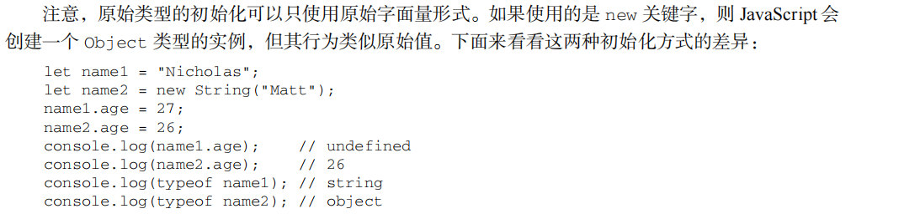

# vacation note

### 基本概念

##### 数据类型

1. null值表示一个空对象指针，使用`typeof`操作符检测null值时会返回“object”

2. undefined值是派生的null值 ,所以`alert(null==undefined) //true`
3. 字面量 


4.  **Symbol**类型（不太会）(查电子版js高级程序设计第四版)

##### 语句

1.  **label**语句 

   ` outerloop: for (let i = 0; i < 3; i++) {  ` 

   `console.log("Outer loop " + i);   `

   ` innerloop:  for (let j = 0; j < 3; j++) {    ` 

   `if (i === 1 && j === 1) {      break outerloop; // 使用 label 跳出外层循环    } `

   `   console.log("Inner loop " + j);  } `   

   `}`

   在上面的示例中，`outerloop` 和 `innerloop` 是两个标签，用来标记外部循环和内部循环。当内部循环中满足条件时，使用 `break outerloop;` 来跳出外层循环。

   请注意，在 JavaScript 中，`label` 语句并不常见，并且可能会导致代码更难理解和维护。因此，建议谨慎使用 `label` 语句，尽可能使用其他更清晰的代码结构和控制流程来达到相同的目的。

2. **with** 语句

   使用 with 语句的主要场景是针对一个对象反复操作，这时候将代码作用域设置为该对象能提供便

   利，如下面的例子所示：

   `let qs = location.search.substring(1); 

   let hostName = location.hostname; 

   let url = location.href; 

   上面代码中的每一行都用到了 location 对象。如果使用 with 语句，就可以少写一些代码：

   with(location) { 

    let qs = search.substring(1); 

    let hostName = hostname; 

    let url = href; 

   } 

   这里，with 语句用于连接 location 对象。这意味着在这个语句内部，每个变量首先会被认为是

   一个局部变量。如果没有找到该局部变量，则会搜索 location 对象，看它是否有一个同名的属性。如

   果有，则该变量会被求值为 location 对象的属性。

   严格模式不允许使用 with 语句，否则会抛出错误。

   **警告**: 由于 with 语句影响性能且难于调试其中的代码，通常不推荐在产品代码中使用 with

   语句

   

##### 函数

 **arguments对象 **：与数组类似，但不是Array实例。 （详见js高级程序设计 P64-66）

### 变量，作用域和内存问题

##### 原始值与应用值

1. 

2.  复制值 

   

3. 传递参数

   * 

   * 

   * 

     

4. 确定类型 

   `instanceof` 语法：`*result* = *variable* instanceof *constructor*`

console.log(person instanceof Object); // 变量 person 是 Object 吗？

console.log(colors instanceof Array); // 变量 colors 是 Array 吗？

console.log(pattern instanceof RegExp); // 变量 pattern 是 RegExp 吗？

**注意** typeof 操作符在用于检测函数时也会返回"function"。当在 Safari（直到 Safari 5）

和 Chrome（直到 Chrome 7）中用于检测正则表达式时，由于实现细节的原因，typeof

也会返回"function"。ECMA-262 规定，任何实现内部[[Call]]方法的对象都应该在

typeof 检测时返回"function"。因为上述浏览器中的正则表达式实现了这个方法，所

以 typeof 对正则表达式也返回"function"。在 IE 和 Firefox 中，typeof 对正则表达式

返回"object"。


##### 执行上下文与作用域

1. 变量声明： 

   **var**:在使用 var 声明变量时，变量会被自动添加到最接近的上下文。在函数中，最接近的上下文就是函

   ​       数的局部上下文。

   如果变量未经声明就被初始化了，那么它就会自动被添加到全局上下文，如下面的例子所示：

   function add(num1, num2) { 

    var sum = num1 + num2; 

    return sum; 

   } 

   let result = add(10, 20); // 30 

   console.log(sum); // 报错：sum 在这里不是有效变量

   这里，函数 add()定义了一个局部变量 sum，保存加法操作的结果。这个值作为函数的值被返回，

   但变量 sum 在函数外部是访问不到的。如果省略上面例子中的关键字 var，那么 sum 在 add()被调用

   之后就变成可以访问的了，如下所示：

   function add(num1, num2) { 

    **sum = num1 + num2;** 

    return sum; 

   } 

   let result = add(10, 20); // 30 

   console.log(sum); // 30 

   这一次，变量 sum 被用加法操作的结果初始化时并没有使用 var 声明。在调用 add()之后，sum

   被添加到了全局上下文，在函数退出之后依然存在，从而在后面可以访问到。

   **注意** 未经声明而初始化变量是 JavaScript 编程中一个非常常见的错误，会导致很多问题。

   为此，读者在初始化变量之前一定要先声明变量。在严格模式下，未经声明就初始化变量

   会报错。

   

   **let**: let 关键字跟 var 很相似，但它的作用域是块级的，这也是 JavaScript 中的新概念。块

   级作用域由最近的一对包含花括号{}界定。

​       **const** 声明只应用到顶级原语或者对象。换句话说，赋值为对象的 const 变量不能再被重新赋值

为其他引用值，但对象的键则不受限制。

const o1 = {}; 

o1 = {}; // TypeError: 给常量赋值

const o2 = {}; 

o2.name = 'Jake'; 

console.log(o2.name); // 'Jake' 

如果想让整个对象都不能修改，可以使用 Object.freeze()，这样再给属性赋值时虽然不会报错，

但会静默失败：

const o3 = Object.freeze({}); 

o3.name = 'Jake'; 

console.log(o3.name); // undefined 

### 基本应用类型

##### Date（详见js高级程序设计电子版5.1）

1. 要创建日期对象，就使用 new 操作符来调用 Date 构造函数：

​         let now = new Date(); 


​       ECMAScript为此提供了两个辅助方法：Date.parse()和 Date.UTC()。


​        Date 类型的 toLocaleString()方法返回与浏览器运行的本地环境一致的日期和时间

2. 日期格式化方法：

   Date 类型有几个专门用于格式化日期的方法，它们都会返回字符串：

    toDateString()显示日期中的周几、月、日、年（格式特定于实现）；

    toTimeString()显示日期中的时、分、秒和时区（格式特定于实现）；

    toLocaleDateString()显示日期中的周几、月、日、年（格式特定于实现和地区）；

    toLocaleTimeString()显示日期中的时、分、秒（格式特定于实现和地区）；

    toUTCString()显示完整的 UTC 日期（格式特定于实现）。

   这些方法的输出与 toLocaleString()和 toString()一样，会因浏览器而异。因此不能用于在

   用户界面上一致地显示日期。

3. 

   

##### RegExp（详见js高级程序设计电子版5.2）

下面给出了表示匹配模式的标记。

 g：全局模式，表示查找字符串的全部内容，而不是找到第一个匹配的内容就结束。

 i：不区分大小写，表示在查找匹配时忽略 pattern 和字符串的大小写。

 m：多行模式，表示查找到一行文本末尾时会继续查找。

 y：粘附模式，表示只查找从 lastIndex 开始及之后的字符串。

 u：Unicode 模式，启用 Unicode 匹配。

 s：dotAll 模式，表示元字符.匹配任何字符（包括\n 或\r）。

1. **RegExp** 实例属性：

   每个 RegExp 实例都有下列属性，提供有关模式的各方面信息。

    global：布尔值，表示是否设置了 g 标记。

    ignoreCase：布尔值，表示是否设置了 i 标记。

    unicode：布尔值，表示是否设置了 u 标记。

    sticky：布尔值，表示是否设置了 y 标记。

    lastIndex：整数，表示在源字符串中下一次搜索的开始位置，始终从 0 开始。

    multiline：布尔值，表示是否设置了 m 标记。

    dotAll：布尔值，表示是否设置了 s 标记。

    source：正则表达式的字面量字符串（不是传给构造函数的模式字符串），没有开头和结尾的

   斜杠。

    flags：正则表达式的标记字符串。始终以字面量而非传入构造函数的字符串模式形式返回（没

   有前后斜杠）。

2. **RegExp** 实例方法：

   RegExp 实例的主要方法是 exec()，主要用于配合捕获组使用。这个方法只接收一个参数，即要应

   用模式的字符串。如果找到了匹配项，则返回包含第一个匹配信息的数组；如果没找到匹配项，则返回

   null。返回的数组虽然是 Array 的实例，但包含两个额外的属性：index 和 input。index 是字符串

   中匹配模式的起始位置，input 是要查找的字符串。这个数组的第一个元素是匹配整个模式的字符串，

   其他元素是与表达式中的捕获组匹配的字符串。如果模式中没有捕获组，则数组只包含一个元素。

   

   如果模式设置了全局标记，则每次调用 exec()方法会返回一个匹配的信息。如果没有设置全局标

   记，则无论对同一个字符串调用多少次 exec()，也只会返回第一个匹配的信息。

   如果模式设置了粘附标记 y，则每次调用 exec()就只会在 lastIndex 的位置上寻找匹配项。粘附

   标记覆盖全局标记。

3. string里的方法

##### 单例内置对象

1. url编码方法：

   encodeURI()和 encodeURIComponent()方法用于编码统一资源标识符（URI），以便传给浏览器。

 这两个方法的主要区别是，encodeURI()不会编码属于 URL 组件的特殊字符，比如冒号、斜杠、问号、

井号，而 encodeURIComponent()会编码它发现的所有非标准字符。来看下面的例子：

`let uri = "http://www.wrox.com/illegal value.js#start"; `

`// "http://www.wrox.com/illegal%20value.js#start" `

`console.log(encodeURI(uri)); `

`// "http%3A%2F%2Fwww.wrox.com%2Fillegal%20value.js%23start" `

`console.log(encodeURIComponent(uri)); `

2. eval()方法

3. Global对象属性

   

4. window对象

5. Math对象

   

### 集合引用类型

`Object`

`Array`

`Map`:是一种可以存储键值对的数据结构，其中键可以是任意数据类型。

- 特点：键是有序且唯一的，可以是对象、字符串或其他数据类型。

- 常用方法：`set(key, value)`、`get(key)`、`has(key)`、`delete(key)` 等。

- 示例：

  let map = new Map();
  map.set('name', 'John');
  map.set('age', 30);
  console.log(map.get('name')); // 输出 "John"

`WeakMap`:是一种类似于 `Map` 的数据结构，键必须是对象类型，且键是弱引用的。

- 特点：键是弱引用的，不会阻止对象被垃圾回收。

- 主要用途：适合存储对象与信息之间的私有映射。

- 示例：

  ```
  let weakMap = new WeakMap();
  let obj = {};
  weakMap.set(obj, 'some value');
  console.log(weakMap.get(obj)); // 输出 "some value"
  ```

`set`：是一种存储唯一值的数据结构，不能包含重复的值。

- 特点：值是有序且唯一的。

- 常用方法：`add(value)`、`has(value)`、`delete(value)` 等。

- 示例：

  ```
  let set = new Set();
  set.add('apple');
  set.add('banana');
  set.add('apple'); // 重复值不会被加入
  console.log(set.size); // 输出 2
  ```

`WeakSet`：是一种类似于 `Set` 的数据结构，但只能存储对象类型。

- 特点：存储的对象是弱引用的，不会阻止对象被垃圾回收。

- 主要用途：用于存储一组对象，而不用担心这些对象会被内存泄漏。

- 示例：

  ```
  let weakSet = new WeakSet();
  let obj1 = {};
  let obj2 = {};
  weakSet.add(obj1);
  weakSet.add(obj2);
  console.log(weakSet.has(obj1)); // 输出 true
  ```

### 对象、类与面向对象编程 

##### 理解对象

1. 数据属性：

    [[Configurable]]：表示属性是否可以通过 delete 删除并重新定义，是否可以修改它的特

   性，以及是否可以把它改为访问器属性。默认情况下，所有直接定义在对象上的属性的这个特

   性都是 true，如前面的例子所示。

    [[Enumerable]]：表示属性是否可以通过 for-in 循环返回。默认情况下，所有直接定义在对

   象上的属性的这个特性都是 true，如前面的例子所示。

    [[Writable]]：表示属性的值是否可以被修改。默认情况下，所有直接定义在对象上的属性的

   这个特性都是 true，如前面的例子所示。

    [[Value]]：包含属性实际的值。这就是前面提到的那个读取和写入属性值的位置。这个特性

   的默认值为 undefined。

   比如：

   ```
   let person = {}; 
   
   Object.defineProperty(person, "name", { 
   
    writable: false, 
   
    value: "Nicholas" 
   
   }); 
   
   console.log(person.name); // "Nicholas" 
   
   person.name = "Greg"; 
   
   console.log(person.name); // "Nicholas"
   ```

   

2. 访问器属性：

    [[Configurable]]：表示属性是否可以通过 delete 删除并重新定义，是否可以修改它的特

   性，以及是否可以把它改为数据属性。默认情况下，所有直接定义在对象上的属性的这个特性

   都是 true。

    [[Enumerable]]：表示属性是否可以通过 for-in 循环返回。默认情况下，所有直接定义在对

   象上的属性的这个特性都是 true。

    [[Get]]：获取函数，在读取属性时调用。默认值为 undefined。

    [[Set]]：设置函数，在写入属性时调用。默认值为 undefined。

   访问器属性是不能直接定义的，必须使用 Object.defineProperty()。下面是一个例子：

   // 定义一个对象，包含伪私有成员 year_和公共成员 edition 

   ```
   let book = { 
   
    year_: 2017, 
   
    edition: 1 }; 
   
   Object.defineProperty(book, "year", { 
   
    get() { 
   
    return this.year_; 
   
    }, 
   
    set(newValue) { 
   
    if (newValue > 2017) { 
   
   this.year_ = newValue; 
   
   this.edition += newValue - 2017; 
   
    } 
   
    } 
   
   }); 
   
   book.year = 2018; 
   
   console.log(book.edition); // 2 
   ```

   

3. 合并对象

   Object.assign()方法：用于将一个或多个源对象的属性复制到目标对象中。它是浅拷贝，即只复制对象的属性值，而不复制对象的引用。如果目标对象中已经有相同属性名的属性，则源对象中的属性值会覆盖目标对象中的属性值。

   ### 注意事项

   - `Object.assign()` 方法会修改目标对象 `target`，并返回目标对象 `target`。
   - 如果目标对象是 `null` 或 `undefined`，`Object.assign()` 会抛出异常。
   - 如果源对象是 `null` 或 `undefined`，`Object.assign()` 会跳过该源对象，并继续处理下一个源对象。
   - `Object.assign()` 方法只复制源对象的自身可枚举属性，不会复制继承属性或不可枚举属性。
   - 如果源对象中的属性值是对象，那么复制的是对象的引用，而不是对象的副本（浅拷贝）。

   `Object.assign()` 方法常用于对象属性的合并或克隆，以及对象属性的覆盖操作。需要注意的是，该方法属于浅拷贝，若要实现深拷贝（即：复制对象的所有属性，包括嵌套对象的属性），需要使用其他方法或工具。

4. 对象标识及判定：Object.is()

5. 增强的对象语法

6. 对象解构

   需要注意的是，涉及多个属性的解构赋值是一个输出无关的顺序化操作。如果一个解构表达式涉及

   多个赋值，开始的赋值成功而后面的赋值出错，则整个解构赋值只会完成一部分：

   ```
   let person = { 
   
    name: 'Matt', 
   
    age: 27 
   
   }; 
   
   let personName, personBar, personAge; 
   
   try { 
   
    // person.foo 是 undefined，因此会抛出错误
   
    ({name: personName, foo: { bar: personBar }, age: personAge} = person); 
   
   } catch(e) {} 
   
   console.log(personName, personBar, personAge); 
   
   // Matt, undefined, undefined 
   ```

   

##### 创建对象

[工厂模式 构造函数模式 原型模式 组合模式]([JavaScript工厂模式_js工厂模式-CSDN博客](https://blog.csdn.net/LUZENG_SA/article/details/126418033?ops_request_misc=%7B%22request%5Fid%22%3A%22172050964316800180641542%22%2C%22scm%22%3A%2220140713.130102334..%22%7D&request_id=172050964316800180641542&biz_id=0&utm_medium=distribute.pc_search_result.none-task-blog-2~all~top_click~default-1-126418033-null-null.142^v100^pc_search_result_base5&utm_term=js工厂模式&spm=1018.2226.3001.4187))

对象迭代：Object.values()和 Object.entries()接收一个对象，返回它们内容的数组。Object.values()

​                   返回对象值的数组，Object.entries()返回键/值对的数组。

##### 继承

1. 原型链
2. 盗用构造函数
3. 组合继承
4. 原型式继承
5. 寄生式继承

​       **注意** 通过寄生式继承给对象添加函数会导致函数难以重用，与构造函数模式类似。

6. 寄生式组合继承

##### 类

1. 类定义：与函数类型相似，定义类也有两种主要方式：类声明和类表达式。这两种方式都使用 class 关键

   字加大括号

2. 类构造函数：

   使用 new 操作符实例化 Person 的操作等于使用 new 调用其构造函数。唯一可感知的不同之处就

   是，JavaScript 解释器知道使用 new 和类意味着应该使用 constructor 函数进行实例化。

   使用 new 调用类的构造函数会执行如下操作。

   (1) 在内存中创建一个新对象。

   (2) 这个新对象内部的[[Prototype]]指针被赋值为构造函数的 prototype 属性。

   (3) 构造函数内部的 this 被赋值为这个新对象（即 this 指向新对象）。

   (4) 执行构造函数内部的代码（给新对象添加属性）。

   (5) 如果构造函数返回非空对象，则返回该对象；否则，返回刚创建的新对象

3. 实例、原型和类成员

### 代理与反射

##### 代理基础

代理是使用 Proxy 构造函数创建的。这个构造函数接收两个参数：目标对象和处理程序对象。缺

少其中任何一个参数都会抛出 TypeError。要创建空代理，可以传一个简单的对象字面量作为处理程

序对象，从而让所有操作畅通无阻地抵达目标对象。

```
const target = { 

 id: 'target' 

}; 

const handler = {}; 

const proxy = new Proxy(target, handler); 

// id 属性会访问同一个值

console.log(target.id); // target 

console.log(proxy.id); // target 

// 给目标属性赋值会反映在两个对象上

// 因为两个对象访问的是同一个值

target.id = 'foo'; 

console.log(target.id); // foo 

console.log(proxy.id); // foo 

// 给代理属性赋值会反映在两个对象上

// 因为这个赋值会转移到目标对象

proxy.id = 'bar'; 

console.log(target.id); // bar 

console.log(proxy.id); // bar 

// hasOwnProperty()方法在两个地方

// 都会应用到目标对象

console.log(target.hasOwnProperty('id')); // true 

console.log(proxy.hasOwnProperty('id')); // true 

// Proxy.prototype 是 undefined 

// 因此不能使用 instanceof 操作符

console.log(target instanceof Proxy); // TypeError: Function has non-object prototype 

'undefined' in instanceof check 

console.log(proxy instanceof Proxy); // TypeError: Function has non-object prototype 

'undefined' in instanceof check 

// 严格相等可以用来区分代理和目标

**console.log(target === proxy); // false**
```

get()捕获器

```
const target = { 
 foo: 'bar' 
}; 
const handler = { 
 // 捕获器在处理程序对象中以方法名为键
 get() { 
 return 'handler override'; 
 } 
}; 
const proxy = new Proxy(target, handler); 
console.log(target.foo); // bar 
console.log(proxy.foo); // handler override 
console.log(target['foo']); // bar 
console.log(proxy['foo']); // handler override 
console.log(Object.create(target)['foo']); // bar 
console.log(Object.create(proxy)['foo']); // handler override
```

可撤销代理

```
const target = { 
 foo: 'bar' 
}; 
const handler = { 
 get() { 
 return 'intercepted'; 
 } 
}; 
const { proxy, revoke } = Proxy.revocable(target, handler); 
console.log(proxy.foo); // intercepted 
console.log(target.foo); // bar 
revoke(); 
console.log(proxy.foo); // TypeError
```

以下反射方法提供只有通过操作符才能完成的操作。

 Reflect.get()：可以替代对象属性访问操作符。

 Reflect.set()：可以替代=赋值操作符。

 Reflect.has()：可以替代 in 操作符或 with()。

 Reflect.deleteProperty()：可以替代 delete 操作符。

 Reflect.construct()：可以替代 new 操作符。

代理另一个代理

```
const target = { 
 foo: 'bar' 
}; 
const firstProxy = new Proxy(target, { 
 get() { 
 console.log('first proxy'); 
 return Reflect.get(...arguments); 
 } 
}); 
const secondProxy = new Proxy(firstProxy, { 
 get() { 
 console.log('second proxy'); 
 return Reflect.get(...arguments); 
 } 
}); 
console.log(secondProxy.foo); 
// second proxy 
// first proxy 
// bar
```

##### 代理捕获器与反射方法

1. get()
2. set()
3. has()
4. defineProperty()
5. getOwnPropertyDescriptor()
6. deleteProperty()
7. ownKeys()
8. getPrototypeOf()
9. setPrototypeOf()
10. isExtensible()
11. preventExtensions()
12. apply()
13. construct()

##### 代理模式

### 函数

##### 箭头函数

##### 函数名

   如果它是使用 Function 构造函数创建的，则会标识成"anonymous"

```
function foo() {} 
let bar = function() {}; 
let baz = () => {}; 
console.log(foo.name); // foo 
console.log(bar.name); // bar 
console.log(baz.name); // baz 
console.log((() => {}).name); //（空字符串）
console.log((new Function()).name); // anonymous
```

如果函数是一个获取函数、设置函数，或者使用 bind()实例化，那么标识符前面会加上一个前缀：

```
function foo() {} 
console.log(foo.bind(null).name); // bound foo 
let dog = { 
 years: 1, 
 get age() { 
 return this.years; 
 }, 
 set age(newAge) { 
 this.years = newAge; 
 } 
} 
let propertyDescriptor = Object.getOwnPropertyDescriptor(dog, 'age'); 
console.log(propertyDescriptor.get.name); // get age 
console.log(propertyDescriptor.set.name); // set age
```

##### 理解参数

在使用 function 关键字定义（非箭头）函数时，可以在函数内部访问 arguments 对象，从中取得传进来的每个参数值。arguments 对象是一个类数组对象（但不是 Array 的实例）

如果函数是使用箭头语法定义的，那么传给函数的参数将不能使用 arguments 关键字访问，而只能通过定义的命名参数访问。

虽然箭头函数中没有 arguments 对象，但可以在包装函数中把它提供给箭头函数：

```
function foo() { 
 let bar = () => { 
 console.log(arguments[0]); // 5 
 }; 
 bar(); 
} 
foo(5); 
```

##### 函数重载

##### 默认参数值

##### 扩展参数

##### 收集参数

##### 函数声明和函数表达式

​     函数声明会被提升

```
// 没问题 
console.log(sum(10, 10)); 
function sum(num1, num2) { 
 return num1 + num2; 
}
```

​     函数表达式不会被提升

```
// 会出错
console.log(sum(10, 10)); 
let sum = function(num1, num2) { 
 return num1 + num2; 
};
```

```
console.log(sum(10, 10)); 
var sum = function(num1, num2) { 
 return num1 + num2; 
};
```

##### 函数作为值

```
function callSomeFunction(someFunction, someArgument) { 
 return someFunction(someArgument); 
}
function add10(num) { 
 return num + 10; 
} 
let result1 = callSomeFunction(add10, 10); 
console.log(result1); // 20 
function getGreeting(name) { 
 return "Hello, " + name; 
} 
let result2 = callSomeFunction(getGreeting, "Nicholas"); 
console.log(result2); // "Hello, Nicholas"
```

##### 函数内部

1. arguments (callee属性)

2. this

   this 引用的是把函数当成方法调用的上下文对象，这时候通常称其为 this 值（在网页的全局上下文中调用函数时，this 指向 windows）。来看下面的例子：

   ```
   window.color = 'red'; 
   let o = { 
    color: 'blue' 
   }; 
   function sayColor() { 
    console.log(this.color); 
   } 
   sayColor(); // 'red' 
   o.sayColor = sayColor; 
   o.sayColor(); // 'blue'
   ```

   在箭头函数中，this引用的是定义箭头函数的上下文。下面的例子演示了这一点。在对sayColor()的两次调用中，this 引用的都是 window 对象，因为这个箭头函数是在 window 上下文中定义的：

```
window.color = 'red'; 
let o = { 
 color: 'blue' 
}; 
let sayColor = () => console.log(this.color); 
sayColor(); // 'red' 
o.sayColor = sayColor; 
o.sayColor(); // 'red'
```

**注意** 函数名只是保存指针的变量。因此全局定义的 sayColor()函数和 o.sayColor()是同一个函数，只不过执行的上下文不同。

箭头函数中的 this 会保留定义该函数时的上下文：

```
function King() { 
 this.royaltyName = 'Henry'; 
 // this 引用 King 的实例
 setTimeout(() => console.log(this.royaltyName), 1000); 
}
```

```
function Queen() { 
 this.royaltyName = 'Elizabeth'; 
 // this 引用 window 对象
 setTimeout(function() { console.log(this.royaltyName); }, 1000); 
} 
new King(); // Henry 
new Queen(); // undefined
```

3. caller

这个属性引用的是调用当前函数的函数，或者如果是在全局作用域中调用的则为 null。

```
function outer() { 
 inner(); 
} 
function inner() { 
 console.log(inner.caller); 
} 
outer();
```

以上代码会显示 outer()函数的源代码。这是因为 ourter()调用了 inner()，inner.caller指向 outer()。如果要降低耦合度，则可以通过 arguments.callee.caller 来引用同样的值：

在严格模式下访问 arguments.callee 会报错。ECMAScript 5 也定义了 arguments.caller，但在严格模式下访问它会报错，在非严格模式下则始终是 undefined。这是为了分清 arguments.caller和函数的 caller 而故意为之的。而作为对这门语言的安全防护，这些改动也让第三方代码无法检测同一上下文中运行的其他代码。

严格模式下还有一个限制，就是不能给函数的 caller 属性赋值，否则会导致错误

4. new.target

   如果函数是正常调用的，则 new.target 的值是 undefined；如果是使用 new 关键字调用的，则 new.target 将引用被调用的

   构造函数。

   ```
   function King() { 
    if (!new.target) { 
    throw 'King must be instantiated using "new"' 
    } 
    console.log('King instantiated using "new"'); 
   } 
   new King(); // King instantiated using "new" 
   King(); // Error: King must be instantiated using "new" 
   ```

   

##### 函数属性与方法

1. 每个函数都有两个属性：length和 prototype。

​       length 属性保存函数定义的命名参数的个数

​       prototype 是保存引用类型所有实例方法的地方，这意味着 toString()、valueOf()等方法实际上都保存在 prototype 上，进而由所有             实例共享。这个属性在自定义类型时特别重要。

​        在 ECMAScript 5中，prototype 属性是不可枚举的，因此使用 for-in 循环不会返回这个属性。

2. 函数还有两个方法：apply()和 call()

##### 尾调用优化

##### 闭包

   1. this

   2. 内存泄漏

      ```
      function assignHandler() { 
       let element = document.getElementById('someElement'); 
       element.onclick = () => console.log(element.id); 
      }
      ```

      无法销毁

      ```
      function assignHandler() { 
       let element = document.getElementById('someElement'); 
       let id = element.id; 
       element.onclick = () => console.log(id);
       element = null; 
      }
      ```

      修改后，element可以被回收

##### 立即调用的函数表达式

```
(function() { 
 // 块级作用域 
})();
```

立即调用的函数表达式有以下几个特点：

1. 创建独立的作用域：函数内部声明的变量只在函数内部有效，不会污染全局作用域。
2. 避免命名冲突：将函数内部的变量和函数与全局作用域隔离开来，避免与外部变量发生命名冲突。
3. 可以传递参数：可以在立即调用的函数表达式后的括号内传递参数。

使用立即调用的函数表达式可以更好地管理代码的作用域和封装性，在需要执行一些初始化操作、避免变量污染全局作用域或提供私有作用域等情况下非常有用

##### 私有变量

### 期约与异步函数

##### 期约

[Promise]([JS高级 之 Promise 详解_js promise-CSDN博客](https://blog.csdn.net/a15297701931/article/details/126133338?ops_request_misc=%7B%22request%5Fid%22%3A%22172053513016800172512679%22%2C%22scm%22%3A%2220140713.130102334..%22%7D&request_id=172053513016800172512679&biz_id=0&utm_medium=distribute.pc_search_result.none-task-blog-2~all~top_positive~default-1-126133338-null-null.142^v100^pc_search_result_base5&utm_term=js promise&spm=1018.2226.3001.4187))

[async await]([理解异步函数async和await的用法_async await用法-CSDN博客](https://blog.csdn.net/weixin_45811256/article/details/123638582?ops_request_misc=%7B%22request%5Fid%22%3A%22172057290516800185834603%22%2C%22scm%22%3A%2220140713.130102334..%22%7D&request_id=172057290516800185834603&biz_id=0&utm_medium=distribute.pc_search_result.none-task-blog-2~all~top_positive~default-1-123638582-null-null.142^v100^pc_search_result_base5&utm_term=async await&spm=1018.2226.3001.4187))

### BOM

##### window

moveTo() moveBy()


innerWidth和 innerHeight 返回浏览器窗口中页面视口的大小（不包含浏览器边框和工具栏）。


document.documentElement.clientWidth 和 document.documentElement.clientHeight返回页面视口的宽度和高度。


可以使用resizeTo()和resizeBy()方法调整窗口大小


度量文档相对于视口滚动距离的属性有两对，返回相等的值：window.pageXoffset/window. scrollX 和 window.pageYoffset/window.scrollY。

可以使用 scroll()、scrollTo()和 scrollBy()方法滚动页面

window.open()

setTimeout()用于指定在一定时间后执行某些代码，而 setInterval()用于指定每隔一段时间执行某些代码。

##### location


##### navigator


##### screen


##### history

go()方法

go()有两个简写方法：back()和 forward()。

history.pushState()

history.replaceState()

### DOM

##### node


操作节点：

appendChild()

insertBefore()

replaceChild()

removeChild()

cloneNode()

normalize()

##### Document

##### Element

getAttribute()、setAttribute()和 removeAttribute()

document.createElement()

appendChild()、insertBefore()或 replaceChild()。

##### Text

##### comment

##### **CDATASection**

##### **DocumentType**

##### **DocumentFragment**

##### **Attr**

##### DOM编程

### DOM扩展

##### Selectors API 

**querySelector()**  **querySelectorAll()**  **matches()**

##### 元素遍历

Element Traversal API 为 DOM 元素添加了 5 个属性：

 childElementCount，返回子元素数量（不包含文本节点和注释）；

 firstElementChild，指向第一个 Element 类型的子元素（Element 版 firstChild）；

 lastElementChild，指向最后一个 Element 类型的子元素（Element 版 lastChild）；

 previousElementSibling ，指向前一个 Element 类型的同胞元素（ Element 版

previousSibling）；

 nextElementSibling，指向后一个 Element 类型的同胞元素（Element 版 nextSibling）

##### HTML5

1. Css类扩展

​         **getElementsByClassName()**

​         **classList** 属性： add(*value*)，向类名列表中添加指定的字符串值 value。如果这个值已经存在，则什么也不做。

​                                       contains(*value*)，返回布尔值，表示给定的 value 是否存在。

​                                       remove(*value*)，从类名列表中删除指定的字符串值 value。

​                                       toggle(*value*)，如果类名列表中已经存在指定的 value，则删除；如果不存在，则添加。

2. 焦点管理  focus()方法

3. HTMLDocument扩展

   . **readyState** 属性 **compatMode** 属性 **head** 属性

4. 自定义数据属性：           使用前缀 data-

5. 插入标记

                    ```
                    <!DOCTYPE html>
                    <html lang="en">
                    <head>
                    <meta charset="UTF-8">
                    <title>innerText, innerHTML, outerText, outerHTML Example</title>
                    </head>
                    <body>
                    <div id="example">
                      <p>This is a <strong>paragraph</strong> element.</p>
                    </div>
                    </body>
                    </html>
                    ```

   ```
   // 获取元素
   const element = document.getElementById('example');
   
   // 示例 innerText
   const innerTextContent = element.innerText;
   console.log('innerText:', innerTextContent); // 输出: This is a paragraph element.
   
   // 示例 innerHTML
   const innerHTMLContent = element.innerHTML;
   console.log('innerHTML:', innerHTMLContent); // 输出: <p>This is a <strong>paragraph</strong> element.</p>
   
   // 示例 outerText
   const outerTextContent = element.outerText;
   console.log('outerText:', outerTextContent); // 输出: This is a paragraph element.
   
   // 示例 outerHTML
   const outerHTMLContent = element.outerHTML;
   console.log('outerHTML:', outerHTMLContent); // 输出: <div id="example"> <p>This is a <strong>paragraph</strong> element.</p> </div>
   ```

   

6. scrollIntoView


